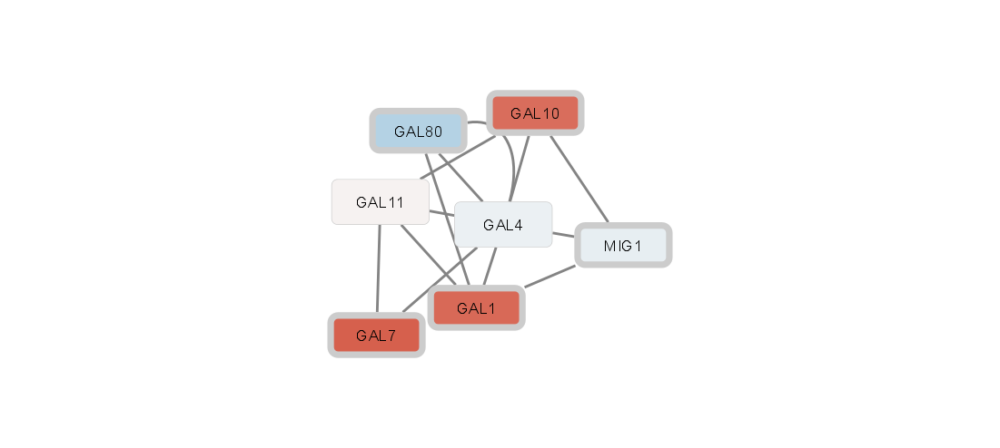
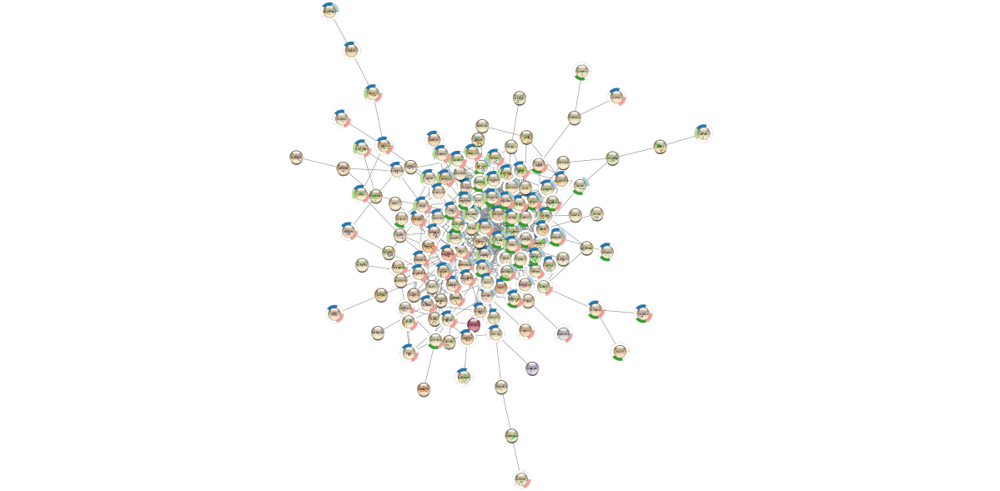
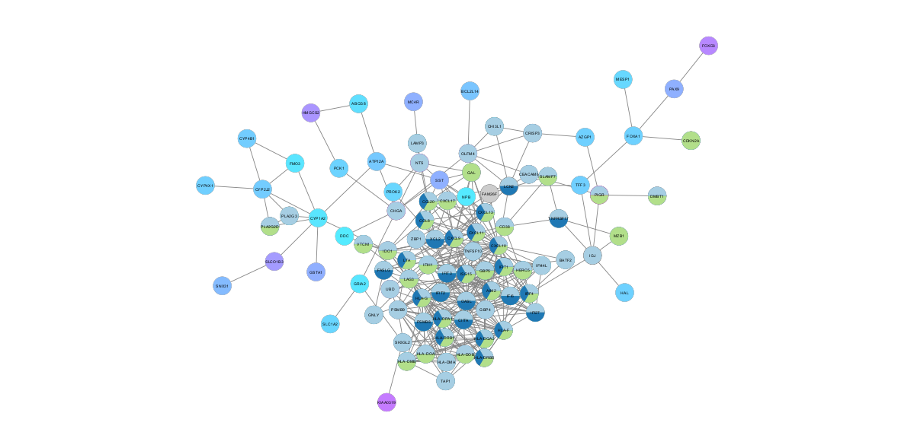
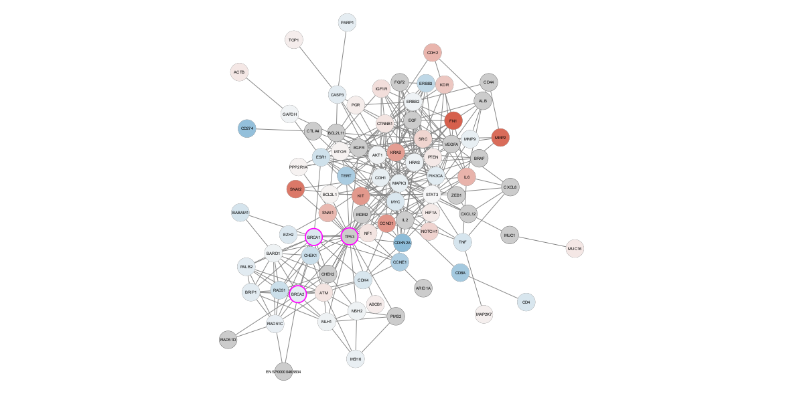
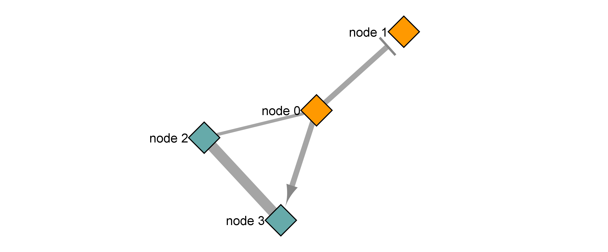
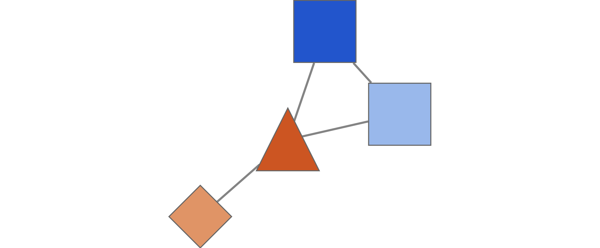

<font size="4">

```{r global-options, include=FALSE}
knitr::opts_chunk$set(warning=FALSE, message=FALSE)
```

# Cytoscape Tutorial Output
During both tutorials Cytoscape often did not offer the same pallettes as the tutorial for visualizing networks, so I improvised a little where I had to.

## Basic Data Visualization



## Differential Expression

Here is the final DE up regulated network



And here is the final down regulated network



And here is the ovarian cancer network



## RCy3

The directions for the lab were a bit unclear on which graphs you wanted presented. I have included the final DataFrame and GraphNEL examples.

DateFrame:



GraphNEL:



