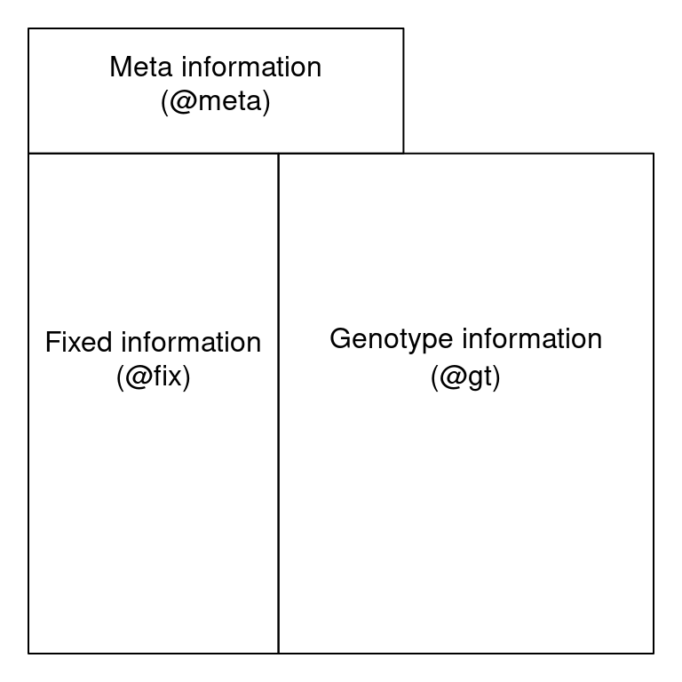

<font size="4">

```{r global-options, include=FALSE}
knitr::opts_chunk$set(warning=FALSE, message=FALSE)
```

# Part I - Reading VCF data

Genetic variation data is typically stored in variant call format (VCF) files (Danecek et al. 2011). This format is the preferred file format obtained from genome sequencing or high throughput genotyping. One advantage of using VCF files is that only variants (e.g., SNPs, indels, etc.) are reported which economizes files size relative to a format that may included invariant sites. Variant callers typically attempt to aggressively call variants with the perspective that a downstream quality control step will remove low quality variants. Note that VCF files come in different flavors and that each variant caller may report a slightly different information. A first step in working with this data is to understand their contents.

## VCF files structure

A VCF file can be thought of as having three sections: a **vcf header**, a **fix region** and a **gt region**. The VCF meta region is located at the top of the file and contains meta-data describing the body of the file. Each VCF meta line begins with a ‘##’. The information in the meta region defines the abbreviations used elsewhere in the file. It may also document software used to create the file as well as parameters used by this software. Below the metadata region, the data are tabular. The first eight columns of this table contain information about each variant. This data may be common over all variants, such as its chromosomal position, or a summary over all samples, such as quality metrics. These data are fixed, or the same, over all samples. The fix region is required in a VCF file, subsequent columns are optional but are common in our experience. Beginning at column ten is a column for every sample. The values in these columns are information for each sample and each variant. The organization of each cell containing a genotype and associated information is specified in column nine, the FORMAT column. The location of these three regions within a file can be represented by this cartoon:
{width=50%}

The VCF file specification is flexible. This means that there are slots for certain types of data, but any particular software which creates a VCF file does not necessarily use them all. Similarly, authors have the opportunity to include new forms of data, forms which may not have been foreseen by the authors of the VCF specification. The result is that all VCF files do not contain the same information.

For this example, we will use example data provided with the R package vcfR (Knaus and Grünwald 2017).
```{r}
library(vcfR)
```
```{r}
data(vcfR_example)
vcf
```

The function `library()` loads libraries, in this case the package *vcfR*. The function `data()` loads datasets that were included with R and its packages. Our usage of `data()` loads the objects ‘gff’, ‘dna’ and ‘vcf’ from the ‘vcfR_example’ dataset. Here we’re only interested in the object ‘vcf’ which contains example VCF data. When we call the object name with no function it invokes the ‘show’ method which prints some summary information to the console.

## The meta region

The meta region contains information about the file, its creation, as well as information to interpret abbreviations used elsewhere in the file. Each line of the meta region begins with a double pound sign (‘##’). The example which comes with vcfR is shown below. (Only the first seven lines are shown for brevity.)
```{r}
strwrap(vcf@meta[1:7]) 
```
The first line contains the version of the VCF format used in the file. This line is required. The second line specifies the software which created the VCF file. This is not required, so not all VCF files include it. When they do, the file becomes self documenting. Note that the alignment software is not included here because it was used upstream of the VCF file’s creation (aligners typically create .SAM or .BAM format files). Because the file can only include information about the software that created it, the entire pipeline does not get documented. Some VCF files may contain a line for every chromosome (or supercontig or contig depending on your genome), so they may become rather long. Here, the remaining lines contain INFO and FORMAT specifications which define abbreviations used in the fix and gt portions of the file.

The meta region may include long lines that may not be easy to view. In vcfR we’ve created a function to help press this data.
```{r}
queryMETA(vcf)
```
When the function queryMETA() is called with only a vcfR object as a parameter, it attempts to summarize the meta information. Not all of the information is returned. For example, ‘contig’ elements are not returned. This is an attempt to summarize information that may be most useful for comprehension of the file’s contents.
```{r}
queryMETA(vcf, element = 'DP')
```
When an element parameter is included, only the information about that element is returned. In this example the element ‘DP’ is returned. We see that this acronym is defined as both a ‘FORMAT’ and ‘INFO’ acronym. We can narrow down our query by including more information in the element parameter.
```{r}
queryMETA(vcf, element = 'FORMAT=<ID=DP')
```
Here we’ve isolated the definition of ‘DP’ as a ‘FORMAT’ element. Note that the function `queryMETA()` includes the parameter `nice` which by default is TRUE and attempts to present the data in a nicely formatted manner. However, our query is performed on the actual information in the ‘meta’ region. It is therefore sometimes appropriate to set `nice = FALSE` so that we can see the raw data. In the above example the angled bracket (‘<’) is omitted from the `nice = TRUE` representation but is essential to distinguishing the ‘FORMAT’ element from the ‘INFO’ element.

## The fix region

The fix region contains information for each variant which is sometimes summarized over all samples. The first eight columns of the fixed region are titled CHROM, POS, ID, REF, ALT, QUAL, FILTER and INFO. This is per variant information which is ‘fixed’, or the same, over all samples. The first two columns indicate the location of the variant by chromosome and position within that chromosome. Here, the ID field has not been used, so it consists of missing data (NA). The REF and ALT columns indicate the reference and alternate allelic states for a diploid sample. When multiple alternate allelic states are present they are delimited with commas. The QUAL column attempts to summarize the quality of each variant over all samples. The FILTER field is not used here but could contain information on whether a variant has passed some form of quality assessment.
```{r}
head(getFIX(vcf))
```
The eigth column, titled INFO, is a semicolon delimited list of information. It can be rather long and cumbersome. The function `getFIX()` will suppress this column by default. Each abbreviation in the INFO column should be defined in the meta section. We can validate this by querying the meta portion, as we did in the ‘meta’ section above.

## The gt region
The gt (genotype) region contains information about each variant for each sample. The values for each variant and each sample are colon delimited. Multiple types of data for each genotype may be stored in this manner. The format of the data is specified by the FORMAT column (column nine). Here we see that we have information for GT, AD, DP, GQ and PL. The definition of these acronyms can be referenced by querying the the meta region, as demonstrated previously. Every variant does not necessarily have the same information (e.g., SNPs and indels may be handled differently), so the rows are best treated independently. Different variant callers may include different information in this region.
```{r}
vcf@gt[1:6, 1:4] #show rows 1-6, columns 1-4
```

## vcfR

Using the R package *vcfR*, we can read VCF format files into memory using the function `read.vcfR()`. Once in memory we can use the `head()` method to summarize the information in the three VCF regions.

```{r}
vcf <- read.vcfR("data/pinfsc50_filtered.vcf.gz")
```
```{r}
head(vcf)
```
After we have made any manipulations of the file we can save it as a VCF file with the function `write.vcf()`.
```{r}
write.vcf(vcf, "data/myVCFdata_filtered.vcf.gz")
```
`write.vcf()` will write a file to your active directory. We now have a summary of our VCF file which we can use to help understand what forms of information are contained within it. This information can be further explored with plotting functions and used to filter the VCF file for high quality variants as we will see in the next section.

## Exercises Part 1
**1)** How would we find more information about `read.vcfR()`?
```{r}
#?read.vcfR Hashing this out so it doesn't open up a broser window every time I knit
```

**2)** How would we learn what the acronym “AD” stands for?
```{r}
queryMETA(vcf, element = 'FORMAT=<ID=AD')
```

**3)** We used the `head()` function to view the first few lines of fix data. How would we view the last few lines of fix data?
```{r}
tail(vcf@fix)
```

**4)** There is a column in the fix portion of the data called QUAL. It is not defined in the meta portion of the data because it is defined in the VCF specification. It stands for ‘quality’. Does QUAL appear useful to us? Why or why not?
+ This column should include some sort of "quality metric" from the upstream processes, if included. It is hard to say without knowing the specifics but we can take a basic look at the data:
```{r}
summary(vcf@fix)
```
...or not. The answer key provides code to look at a histogram 
```{r}
plot(vcf)
```

So a very wide variation in quality but most on lower end.

**5)**  How would we query the sample names?
```{r}
colnames(vcf@gt)
```

Note that the first column is `FORMAT`. This tells us the format for data for each variant. According to the VCF specification this can be different for each variant.

#Part II - Analysis of Genome Data

## Introduction
Analysis of genome data for populations can be seen as similar to the analyses of other marker systems discussed in previous chapters of this book, except that genome data analyses include larger quantities of data. For example, VCF data (discussed in ‘reading VCF data’) can be read into R using vcfR (Knaus and Grünwald 2017) to create a vcfR object. This object can be converted into a genlight object (Jombart 2008) and then a snpclone object (Kamvar, Tabima, and Grünwald 2014, @kamvar2015novel) if deemed necessary. Analysis on these objects has been covered in previous sections. Genome scale data provides additional analytical options as well. For example, when assumptions about the neutrality of the majority of the genome are appropriate, this can be used as a null hypothesis and used to help identify markers that differentiate from this assumption. Here we’ll provide examples of how genomic data may be analyzed.

For genomics examples we’ll use the pinfsc50 dataset. The pinfsc50 dataset is from a number of published *P. infestans* genomics projects where the data has been subset here to supercontig_1.50. This dataset is available as a stand alone R package (Knaus and Grünwald 2017) or be download from the course repo By subsetting the data to one supercontig it creates a dataset of a size that can be conveniently used for examples. This dataset illustrates some important strengths and weaknesses of these studies. A strength is the amount of data we have for each individual. Among the weaknesses are that the samples are ‘opportunistic’ in that we have no control over the design of the experiment. Also, because of the large investment in data per sample, there is a relatively small number of samples.

## Opening and examining the dataset
We’ll read our VCF data into R using the function `read.vcfR()`. This is data from the pinfsc50 data set that we filtered for quality in the section reading VCF data. Once the file is read in we can validate its contents using the `show` method which is implemented by executing the object’s name at the prompt.
```{r}
library('vcfR')
vcf <- read.vcfR("data/pinfsc50_filtered.vcf.gz")
```
```{r}
vcf
```
The `show` method reports that we have 18 samples and 2,190 variants. If this matches our expectation then we can proceed.

## Converting VCF data to a genlight object

Different R packages have created different data structures to hold your data when it is imported into R. This is analagous to the different file formats you may have used to analyze your data in software outside of R. We’ve tried to engineer a suite of functions to convert data structures among the various R packages we typically use. The R package adegenet is a popular R package used for population genetic analysis and it works on data structures called ‘genlight’ objects. Here we use the function `vcfR2genlight()` to convert our vcfR object to a genlight object. This makes our VCF data available to the analyses in adegenet.
```{r}
x <- vcfR2genlight(vcf)
```
```{r}
x
```
A genlight object only supports biallelic, or binary, variants. That is, variants with no more than two alleles. However, variant call format data can include multiple alleles. When we created our genlight object we recieved a warning message indicating that our vcfR object had variants with more than two alleles and that it was being subset to only biallelic variants. This is one of several important differences in how data is handled in VCF data versus genlight objects.

Another important difference among VCF and genlight data is how the genotypes are stored. In VCF data the alleles are delimited by either a pipe or a forward slash (‘|’, ‘/’ respectively). Because genlight objects only use biallelic loci the genotypes can be recoded as 0, 1 and 2. These correspond to homozygous for the reference or zero allele, heterozygote or homozygous for the first alternate allele. We can validate this by checking a few select genotypes from both the vcfR object and the genlight object.
```{r}
gt <- extract.gt(vcf, element = "GT")
gt[c(2,6,18), 1:3]
```
```{r}
# genlight
t(as.matrix(x))[c(1,5,17), 1:3] #note use of t() to transpose
```
Note that in VCF data the samples are in columns and the variants are in rows. In genlight objects, and many other R objects, the samples are in rows while the variants are in columns. We can use the transpose function (`t()`) to convert between these two states.

Yet another difference among VCF data and genlight objects is that in VCF data there is no concept of ‘population.’ The package adegenet was designed specifically for the analysis of population data, so its genlight object has a place (a ‘slot’) to hold this information. Because there is no population data in VCF data, if we want population data we’ll have to set it ourselves.
```{r}
library(adegenet)
```
```{r}
pop(x) <- as.factor(c("us", "eu", "us", "af", "eu", "us", "mx", "eu", "eu", "sa", "mx", "sa", "us", "sa", "Pmir", "us", "eu", "eu"))
popNames(x)
```
Our population designation consists of a vector, that is the same length as the number of samples we have, where each element indicates which population each sample belongs to. By using the `as.factor()` function we transform the “vector” into a “factor”. A factor understands that all of the elements that are named “us” or “eu” are all part of the same group. This is why when we ask for the popNames we get a vector where each population is represented only once.

Yet another difference among VCF data and genlight objects is the concept of ploidy. In VCF data each variant is treated independently. This means that in theory VCF data may contain data that is of mixed ploidy. In a genlight object different samples may be of different ploidy levels, but within each sample all of its loci must be of the same ploidy level. Here we’ll set the ploidy of all the samples in the genlight object to the same ploidy.
```{r}
ploidy(x) <- 2
```

## Distance matrices
Let’s create a pairwise genetic distance matrix for individuals or populations (i.e., groups of individuals).

To summarize, we can create a distance matrix from a genlight object using `dist()`:
```{r}
x.dist <- dist(x)
```
Note, that we have not specified what the variable `x` is. We can find documentation for this function with `?dist`.

There are also functions to create distance matrices from genlight objects that exist in other packages. The function `bitwise.dist()` in the package *poppr* is an example. We can find documentation for this function with `?poppr::bitwise.dist`. Again, you need to know where to look for this information or you may not find it. We can use this function as follows.
```{r}
x.dist <- poppr::bitwise.dist(x)
```
Note, that the variable x has not yet been specified. Lastly, because you can use `as.matrix()` on your genlight object, and most distance algorithms can use this matrix as input, you can use this as an intermediate step to create a matrix from your genlight object and pass it to your distance algorithm of choice. Options include *ade4*, `vegdist()` in *vegan*, or `daisy(`) in *cluster.* Note that it is up to you to determine which distance metric is best for your particular analysis. A number of options therefore exist for creating distance matrices from genlight objects.

## chromR objects
### Using chromR to locate unusual features in a genome
Genomic projects frequently incorporate several types of data. For example, the reference sequence may be stored as a FASTA format file, variants (SNPs, indels, etc.) may be stored in a variant call format (VCF) file while annotations may be stored as a GFF or BED format (tablular data). Genome browsers can be used to integrate these different data types. However, genome browsers typically lack a manipulation environment, they simply display existing files. The R environment includes a tremendous amount of statistical support that is both specific to genetics and genomics as well as more general tools (e.g., the linear model and its extensions). The R package vcfR provides a link between VCF data and the R environment and it includes a simple genome browser to help visualize the effect of manipulations. Here we explore how we can use vcfR to survey genomic data for interesting features.

## Creating chromR objects
In this example we will begin by locating the example data from the pinfsc50 package. This is a separate package from vcfR that you will need to install. If you haven’t installed it already, you can install it with `install.packages('pinfsc50')`. For data from your own research activities you may wany to omit the `system.file()` steps and directly use your filenames in the input steps.
```{r}
library(vcfR)

# Find the files.
vcf_file <- system.file("extdata", "pinf_sc50.vcf.gz", package = "pinfsc50")
dna_file <- system.file("extdata", "pinf_sc50.fasta", package = "pinfsc50")
gff_file <- system.file("extdata", "pinf_sc50.gff", package = "pinfsc50")

# Input the files.
vcf <- read.vcfR(vcf_file, verbose = FALSE)
dna <- ape::read.dna(dna_file, format = "fasta")
gff <- read.table(gff_file, sep="\t", quote="")

# Create a chromR object.
chrom <- create.chromR(name="Supercontig", vcf=vcf, seq=dna, ann=gff, verbose=TRUE)
```
Note that a warning message indicates that the names in all of the data sources do not match pefectly. It has been my experience that this is a frequent occurrence in genome projects. Instead of asking the user to create duplicate files that have the same data but standardized names, vcfR allows the user to exercise some judgement. If you see this message and feel the names are correct you can ignore this and proceed. In this case we see that a chromosome is named ‘Supercontig_1.50’ in the VCF data but named ‘Supercontig_1.50 of Phytophthora infestans T30-4’ in the FASTA (sequence) file. Because we know that for this specific project these are synonyms we can safely ignore the warning and proceed.

Once we have created our chromR object we can verify that its contents are what we expect. By executing the object’s name at the console, with no other arguments, we invoke the object’s ‘show’ method. The show method for chromR objects presents a summary of the object’s contents.
```{r}
chrom
```
There at least two ways to graphically view the chromR object. The first is plot() which plots histograms of some of data summaries.

```{r}
plot(chrom)
```

The read depth here is a sum over all samples. We see a peak that represents the depth where most of our genomes were sequenced at. Low regions of sequence depth may indicate variants where we may be concerned that there may not be enough information to call a genotype. Variants of high coverage may represent repetetive regions of genomes where the reference may not contain all the copies so the reads pile up on the fraction of repeats that were successfully assembled. These regions may violate the ploidy assumptions made by variant callers and therefore may be considered a target for quality filtering. Mapping quality is very peaked at 60 but also contains variants that deviate from this common value. Quality (QUAL) is less easily interpreted. It appears that most of our variants are of a low quality with very few of them being of high quality. It is important to remember that while everyone would like high quality, quality is frequently difficult to measure. The simplest interpretation here is that QUAL may not be a good parameter to use to judge your variants. The last panel for SNP densities is empty because this data is created during the processing of chromR objects, which we will discuss below.

```{r}
chromoqc(chrom, dp.alpha = 66)
```

Our second plot, called chromo plot, displays the same information as the plot method only it distributes the data along its chomosomal coordinates. It also includes a representation of the annotation data. The contents of this plot are somewhat flexible in that it depends on what data is present in the chromR object.

## Processung chromR objects

Creation and processing of a chromR object has been divided into separate tasks. Creation loads the data into the chromR object and should typically only be required once. Processing the chromR object generates summaries of the data. Some of these summaries will need to be updated as the chromR object is updated. For example, if the size of the sliding window used to summarize variant density and GC content is changed the chromR object will need to be processed to update this information.

```{r}
chrom <- proc.chromR(chrom, verbose = TRUE)
```
```{r}
plot(chrom)
```

Subsequent to processing, our plot function is identical to its previous presentation except that we now have variant densities. When we observe the chromoqc plot we see that we now have variant densities, nucleotide content as well as a representation of where in our reference we have nucleotides (A, C, G or T) or where we have ambiguous nucleotides.

```{r}
chromoqc(chrom, dp.alpha = 66)
```

The above data is an example of visualizing raw data that has come from a variant caller and other automated sources. In our section on quality control we presented methods on how to filter variants on various parameters as an attempt to omit low quality variants. We can use this data to create a chromR object and compare it to the above data.

```{r}
#vcf <- read.vcfR("pinfsc50_qc.vcf.gz", verbose = FALSE)
vcf <- read.vcfR("data/pinfsc50_filtered.vcf.gz", verbose = FALSE)
chrom <- create.chromR(name="Supercontig", vcf=vcf, seq=dna, ann=gff, verbose=FALSE)
chrom <- proc.chromR(chrom, verbose = FALSE)
chromoqc(chrom, dp.alpha = 66)
```

We have a smaller quantity of data after our quality control steps. However, there do appear to be a few improvements. First, the read depth is now fairly uniform and lacks the large variation in depth we saw in the raw data. In genomics projects our naive assumption is that we would sequence all regions of the genome at the same depth. So this change in the data allows it to approach our expectation. Second, the mapping quality appear relatively constant and the variants with low mapping quality have been omitted. If we feel that ‘mapping quality’ is a reasonable assessment of quality, we may interpret this as an improvement. These are methods we feel improve the quality of our datasets prior to analysis.

## Tabular summaries
When we process a chromR object, two forms of tabular data are created. First, summaries are made on a per variant basis. This includes sample size (minus missing data), allele counts, heterozygosity and effective size. Second, summaries are made on a per window basis. Window size can be changed with the `win.size` parameter of the function `proc.chromR()`. Window based summaries include nucleotide content per window (including missing data so you can adjust window size for analyses if necessary), the number of genic sites per window (when annotation information was provided) and the number of variants per window.
```{r}
head(chrom@var.info)
```
```{r}
head(chrom@win.info)
```
While loading entire genomes into memory may not be practical due to resource limitations, it is frequently practical to break a genome up into fractions that can be processed given the resources available on any system. By processing a genome by chromosomes, or some other fraction, and saving this tabular data to file you can perform genome scans in an attempt to identify interesting features.

## Genetic differentiation

A fundamental question to most population studies is whether populations are diverse and whether this diversity is shared among the populations? To address the question of within population diversity geneticists typically report heterozygosity. This is the probability that two alleles randomly chosen from a population will be different (Nei 1973). Ecologists may know this as Simpson’s Index (Simpson 1949). To address differentiation population geneticists typically utilize FST or one of its analogues. Population differentiation measured by FST was originally proposed by Sewall Wright (Wright 1949). This was later extended to a method based on diversity by Masatoshi Nei (Nei 1973). As researchers applied these metrics to microsatellites, genetic markers with a large number of alleles, it became clear that Nei’s measure would not correctly range from zero to one, so Philip Hedrick proposed a correction (Hedrick 2005). More recently, Lou Jost proposed another alternative (Jost 2008). You can tell a topic is popular when so many variants of it are generated. And there are more variants than mentioned here. A nice discussion as to which measure may be appropriate for your data was posted to the Molecular Ecologist blog titled should I use FST, GST or D?.

In `vcfR`, the function `genetic_diff()` was implemented to measure population diversity and differentiation. Because VCF data typically do not include population information we’ll have to supply it as a factor. The method ‘nei’ employed here is based on the methods reported by Hedrick (Hedrick 2005). The exception is that the heterozygosities are weighted by the number of alleles observed in each population. This was inspired by `hierfstat::pairwise.fst()` which uses the number of individuals observed in each population to weight the heterozygosities. By using the number of alleles observed instead of the number of individuals we remove an assumption about how many alleles each individual may contribute. That is, we should be able to accomodate samples of mixed ploidy.
```{r}
library(vcfR)
data(vcfR_example)
pop <- as.factor(c("us", "eu", "us", "af", "eu", "us", "mx", "eu", "eu", "sa", "mx", "sa", "us", "sa", "Pmir", "us", "eu", "eu"))
myDiff <- genetic_diff(vcf, pops = pop, method = 'nei')
knitr::kable(head(myDiff[,1:15]))
```
The function returns the chromosome and position of each variant as provided in the VCF data. This should allow you to align its output with the VCF data. The heterozygosities for each population are reported as well as the total heterozygosity, followed by the number of alleles observed in each population. Note that in some populations zero alleles were observed. Populations with zero alleles reported heterozygosities of ‘NaN’ because of this absence of data.
```{r}
knitr::kable(head(myDiff[,16:19]))
```
The remaining columns contain GST, the maximum heterozygosity, the maximum GST and finally G′ST. The maximum heterozygosity and the maximum GST are intermediary values used to calculate G′ST. They are typically not reported but provide values to help validate that G′ST was calculated correctly. Note that the populations that had zero alleles, and therefore a heterozygosity of ‘NaN’, contributed to GSTs that were also ‘NaN’. To avoid this you may want to consider omitting populations with a small sample size or that contain a large amount of missing data.

We now have information for each variant in the VCF data. Because this is typically a large quantity of information, we’ll want to summarize it. One way is to take averages of the data.
```{r}
knitr::kable(round(colMeans(myDiff[,c(3:9,16,19)], na.rm = TRUE), digits = 3))
```
Another way to summarize data is to use violin plots.
```{r}
library(reshape2)
library(ggplot2)

dpf <- melt(myDiff[,c(3:8,19)], varnames=c('Index', 'Sample'), value.name = 'Depth', na.rm=TRUE)
```
```{r}
p <- ggplot(dpf, aes(x=variable, y=Depth)) + geom_violin(fill="#2ca25f", adjust = 1.2)
p <- p + xlab("")
p <- p + ylab("")
p <- p + theme_bw()
p
```

## Exercises Part II (Exercises Strike Back)
**1)** Make a Manhattan Plot...I had to look up what this was. Nice origin story. So, position on x-axis and g-prime on y...the myDiff file created above had both of those values.
```{r}
ggplot(myDiff, aes(x=as.integer(POS), y=Gprimest))+
  geom_point(color="purple", alpha=0.3)+
  labs(x = "Genomic position",
       y = expression(italic("G'"["ST"])))+
  theme_bw()
```

**2)** Having never seen a Manhattan plot before I am not sure what shoudl look usual or not. Reference one's on the web have grouping by chromosome and such? The answer key informs me that it si small sample size? 
```{r}
table(pop)
```

I feel like a lot of genomics papers have pretty darn small sample sizes though?

**3)** Well, the first step would be to query the documentation via `?chromoqc()`. This shows that options are included to specify the start and end of the chromosome position using `chrom.s` and `chrom.e`, but that is deprecated so now you use `xlim`. Let's give that a whirl. Here is the stock plot from above,
```{r}
chromoqc(chrom, dp.alpha = 66)
```

and here is the new one focused in on focused in on 1e+05 through 3e+05,
```{r}
chromoqc(chrom, dp.alpha = 66, xlim =c(1e+05, 3e+05))
```

So that looks like it works, and conforms to the answer provided in the lab as well. Good stuff.

**4)** I used the `queryMETA()` function to look at what was available then looked specifically at Inbreeding Coefficient information, because inbreeding is **ALWAYS** interesting?
```{r}
queryMETA(vcf)
```

```{r}
queryMETA(vcf, element = 'InbreedingCoeff')
```

