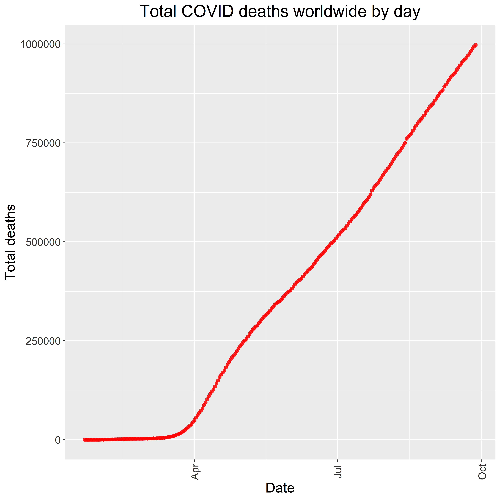

<font size="4">

```{r setup, message=FALSE, warning=FALSE}
library(tidyverse)
library(lubridate)
library(pals)
library(plotly)
library(gganimate)
library(transformr)

grey_theme <- theme(axis.text.x = element_text(colour="grey20", size = 12, 
                                               angle = 90, hjust = 0.5, 
                                               vjust = 0.5),
                    axis.text.y = element_text(colour = "grey20", size = 12),
                    text=element_text(size = 16))
```

Challenge 1: Print a graph to .png using 3*ppi for the height and width and display the png file in the report using the above R Markdown format.

```{r load manipulate and clean data for challenges, echo=FALSE, message=FALSE, warning=FALSE, results = "hide"}
#dl and read in cases
download.file(url="https://raw.githubusercontent.com/CSSEGISandData/COVID-19/master/csse_covid_19_data/csse_covid_19_time_series/time_series_covid19_confirmed_global.csv", 
              destfile = "data/time_series_covid19_confirmed_global.csv")
time_series_confirmed <- read_csv("data/time_series_covid19_confirmed_global.csv")%>%
  rename(Province_State = "Province/State", Country_Region = "Country/Region")

#dl and read in deaths
download.file(url="https://raw.githubusercontent.com/CSSEGISandData/COVID-19/master/csse_covid_19_data/csse_covid_19_time_series/time_series_covid19_deaths_global.csv", 
              destfile = "data/time_series_covid19_deaths_global.csv")
time_series_deaths <- read_csv("data/time_series_covid19_deaths_global.csv")%>%
  rename(Province_State = "Province/State", Country_Region = "Country/Region")

#Convert to long format
time_series_confirmed_long <- time_series_confirmed %>% 
  pivot_longer(-c(Province_State, Country_Region, Lat, Long),
               names_to = "Date", values_to = "Confirmed") 

time_series_deaths_long <- time_series_deaths %>% 
  pivot_longer(-c(Province_State, Country_Region, Lat, Long),
               names_to = "Date", values_to = "Deaths") 
head(time_series_deaths_long)

#Merge cases and deaths
time_series_confirmed_long <- time_series_confirmed_long %>% 
  unite(Key, Province_State, Country_Region, Date, sep = ".", remove = FALSE)
head(time_series_confirmed_long)

time_series_deaths_long <- time_series_deaths_long %>% 
  unite(Key, Province_State, Country_Region, Date, sep = ".") %>% 
  select(Key, Deaths)

time_series_long_joined <- full_join(time_series_confirmed_long,
                                     time_series_deaths_long, by = c("Key")) %>% 
  select(-Key)
head(time_series_long_joined)
which(is.na(time_series_long_joined$Confirmed)) #QAQC
which(is.na(time_series_long_joined$Deaths)) #QAQC

#Change date format
time_series_long_joined$Date <- mdy(time_series_long_joined$Date)

#Total deaths per day worldwide
dailydeaths<-time_series_long_joined %>% 
  group_by(Date) %>% 
  summarize(Deaths=sum(Deaths))

#Deaths/Confirmed cases
USratio <- time_series_long_joined %>% 
  filter(Country_Region == "US") %>% 
  mutate(ratio = Deaths/Confirmed) %>% 
  select(-Province_State, -Lat, -Long)
```

```{r plot as .png, message=FALSE, warning=FALSE, results = "hide"}
#Output plot to .png file
ppi <- 600
#Initiate plot as .png
png("images/time_series_example_plot.png", width=8*ppi, height=8*ppi, res=ppi)
ggplot(dailydeaths, aes(Date, Deaths)) +
  geom_point(color="red", alpha=0.8) +
  geom_line(color="red", alpha=0.8)+
  labs(title = "Total COVID deaths worldwide by day",
       x = "Date",
       y = "Total deaths") +
  theme(plot.title = element_text(hjust = 0.5)) +
  grey_theme
dev.off()
```
 

Challenge 2: Turn one of the exercises from Lab 5 into an interactive graph with plotyly

```{r use plotly data, message=FALSE, warning=FALSE, results = "hide", echo = FALSE}
#Top 10 deaths time series
tops<-time_series_long_joined %>% 
  group_by(Country_Region) %>% 
  summarize(most=sum(Deaths)) %>% 
  arrange(desc(most)) %>% 
  slice(1:10)
most<-tops$Country_Region
deathTS<-filter(time_series_long_joined, Country_Region %in% most) %>% 
  group_by(Date,Country_Region) %>% 
  summarize(Deaths=sum(Deaths)) %>% 
  rename(Country = Country_Region)

```

```{r plotly plot, fig.height=8}
#TS plot
plot <- 
  ggplot(deathTS, aes(Date, Deaths, color=Country)) +
  #geom_point(color="red", alpha=0.8) +
  geom_line(alpha=0.8, size=1.0)+
    labs(title = "Daily COVID deaths (10 highest totals)",
       x = "Date",
       y = "Total deaths") +
  scale_color_manual(values=as.vector(pals::glasbey(32)), name = "Country") +
  theme(plot.title = element_text(hjust = 0.5),
        legend.title = element_blank()) +
  grey_theme
ggplotly(plot) %>% 
  layout(legend = list(x=100, y=0.5))
```

Challenge 3. Create an animated graph of your choosing using the time series data to display an aspect (e.g. states or countries) of the data that is important to you.

```{r animate fatality ratio, message=FALSE, warnings=FALSE}
#Plot
p <-
  ggplot(USratio, aes(Date, ratio)) +
    geom_area(color="blue", fill = "blue", alpha= 0.4) +
labs(title = "US deaths to confirmed cases ratio by day",
     x = "Date",
     y = "Deaths:Confirmed cases") +
  theme(plot.title = element_text(hjust = 0.5)) +
  grey_theme +
  transition_reveal(Date)
animate(p, end_pause = 20)
```


