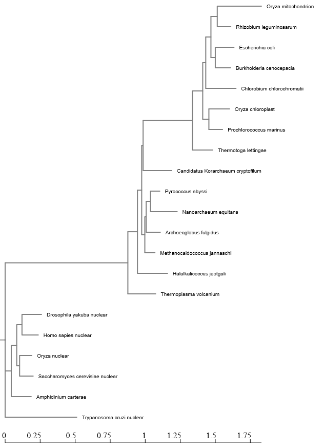
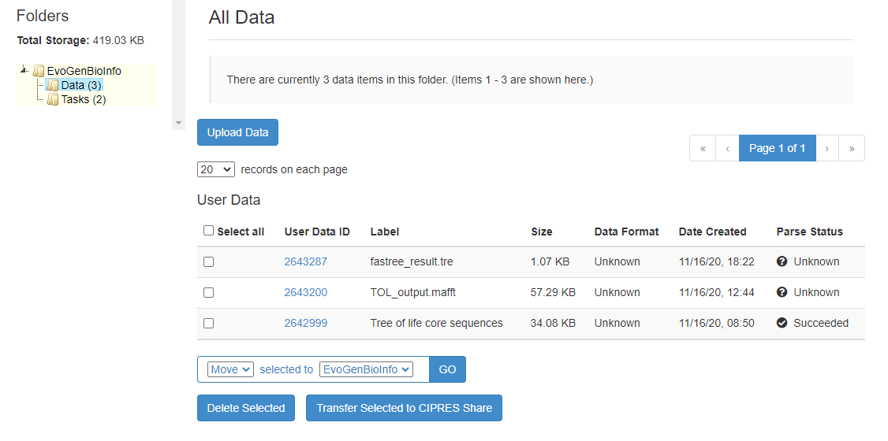

<font size="4">

```{r global-options, include=FALSE}
knitr::opts_chunk$set(warning=FALSE, message=FALSE)
```

# Exercise 1: NGPhylogeny.fr

I ran the supplied sequence through the NGPhlyogeny process using the base settings. The process consisted of MAFFT sequence alignment, sequence curation via BMGE, and then Tree generation through FastME. The link to the output is [here](ngphylogeny.fr/workspace/history/7fa599d605da210a)

This is the generated tree:




# Exercise 2: Cipres

I followed the instructions in the tutorial to successfully run the analyses and save the results to my computer.



# Exercise 3: R and ggtree tutorial

## Basic trees
```{r}
library(tidyverse)
library(ggtree)
tree <- read.tree("data/tree_newick.nwk")
tree
```

```{r}
# build a ggplot with a geom_tree
ggplot(tree) + geom_tree() + theme_tree()
# This is convenient shorthand
ggtree(tree)
```

2 ways to add a scale bar
```{r}
ggtree(tree) + geom_treescale()
# or add the entire scale to the x axis with theme_tree2()
ggtree(tree) + theme_tree2()
```

Or forego all scales and produce a cladogram
```{r}
ggtree(tree, branch.length="none")
```

Make a tree using commands withing the ggtree options rather than added `geom`s or `aes` statement
```{r}
ggtree(tree, branch.length="none", color="blue", size=2, linetype=3)
```

### Execise 1

1. Create a slanted phylogenetic tree:
```{r}
ggtree(tree,  layout = "slanted") + theme_tree2()
```

2. Create a circular phylogenetic tree:
```{r}
ggtree(tree,  layout = "circular") + theme_tree2()
```

3. Create a circular unscaled cladogram with thick red lines:
```{r}
ggtree(tree,
       layout = "circular",
       branch.length="none",
       color="red", size=3
       ) 
```

### Other tree geoms

Examples of how to add layers 
```{r}
# create the basic plot
p <- ggtree(tree)
# add node points
p + geom_nodepoint()
# add tip points
p + geom_tippoint()
# Label the tips
p + geom_tiplab()
```

### Exercise 2

```{r}
p + 
  geom_nodepoint(shape=19, color="goldenrod2", alpha=0.5, size=4) +
  geom_tippoint(shape=18, color="purple") +
  geom_tiplab(color="purple") +
  ggtitle("Ex. 2 Figure: Replicating a pig with lipstick")
  
```

## Tree annotation

### Internal node numbers
We can visualize how `ggtree` is mapping nodes
```{r}
ggtree(tree) + geom_text(aes(label=node), hjust=-.3)
```

This can also be done using a vector of taxa names and the most recent common ancestor fucntion, `MRCA()`. The first step is to recreate the basic tree
```{r}
ggtree(tree) + geom_tiplab()
```

Then use `MRCA()` to get the most recent common ancestors for taxa C+E and G+H.
```{r}
MRCA(tree, c("C", "E"))
```

```{r}
MRCA(tree, c("G", "H"))
```

### Labeling clades

The `geom_cladelabel()` function can be used to label nodes and such. Here we can use the `MRCA` results to label the common ancestor of C+E
```{r}
ggtree(tree) + 
  geom_cladelabel(node=17, label="clade clownin'", color="red")
```

Add back in tip labels and adjust
```{r}
ggtree(tree) + 
  geom_tiplab() + 
  geom_cladelabel(node=17, label="Some random \nclade", 
                  color="red2", offset=1.1)
```

Keep on keepin' on
```{r}
ggtree(tree) + 
  geom_tiplab() + 
  geom_cladelabel(node=17, label="Some random clade", 
                  color="red2", offset=.8) + 
  geom_cladelabel(node=21, label="A different clade", 
                  color="blue", offset=.8)
```

Well that looks not so good. Luckily you gave us a way to make it look good. It even takes advantage of ggplot's (I think) annoying feature of staking themes or layers which can create all sorts of issues
```{r}
ggtree(tree) + 
  geom_tiplab() + 
  geom_cladelabel(node=17, label="Some random clade", 
                  color="red2", offset=.8, align=TRUE) + 
  geom_cladelabel(node=21, label="A different clade", 
                  color="blue", offset=.8, align=TRUE) + 
  theme_tree2() + 
  xlim(0, 70) + 
  theme_tree()
```

Another option is to highlight clades
```{r}
ggtree(tree) + 
  geom_tiplab() + 
  geom_hilight(node=17, fill="gold") + 
  geom_hilight(node=21, fill="purple")
```

### Connecting taxa

Sometimes things happen. And when these things happen you might want some fancy lines connecting your taxa. Luckily, `geom_taxalink()` does just that! It is like they thought of everything!!!
```{r}
ggtree(tree) + 
  geom_tiplab() + 
  geom_taxalink("E", "H", color="blue3") +
  geom_taxalink("C", "G", color="orange2", curvature=-.9)
```

### Exercise 3

Just another funny graph
```{r}
MRCA(tree, c("B", "C"))
MRCA(tree, c("L", "J"))
```

```{r}
ggtree(tree) + 
  geom_tiplab() + 
  geom_hilight(node=19, fill="coral") + 
  geom_hilight(node=23, fill="plum2") +
  geom_cladelabel(node=17, label="Superclade 17", 
                  color="red2", offset=1.3) +
   geom_taxalink("C", "E", color="gray", linetype=2) +
  geom_taxalink("G", "J", color="gray", linetype=2) +
  xlim(0,75)+
  ggtitle("Ex. 3: Monkey see, monkey do") +
  theme_tree2() 
```

## Advanced tree notation

Here is a fancier tree using BEAST output of H1N1 data.
```{r}
# Read the data
tree <- treeio::read.beast("data/flu_tree_beast.tree")
# supply a most recent sampling date so you get the dates
# and add a scale bar
ggtree(tree, mrsd="2013-01-01") + 
  theme_tree2() 
# Finally, add tip labels and adjust axis
ggtree(tree, mrsd="2013-01-01") + 
  theme_tree2() + 
  geom_tiplab(align=TRUE, linesize=.5) + 
  xlim(1990, 2020)
```

We can also combine trees and alignment data. Which is just way too confusing!
```{r}
msaplot(p=ggtree(tree), fasta="data/flu_aasequence.fasta", window=c(150, 175))
```

## Bonus!

### Many trees

You can `facet_wrap` trees. I love the title you gave it.
```{r}
set.seed(42)
trees <- lapply(rep(c(10, 25, 50, 100), 3), rtree)
class(trees) <- "multiPhylo"
ggtree(trees) + facet_wrap(~.id, scale="free", ncol=4) + ggtitle("Many trees. Such phylogenetics. Wow.")
```

### Plot trees with other data

You can also use `facet_plot` to combine tree output with other data visualizations,
```{r}
# Generate a random tree with 30 tips
tree <- rtree(30)
# Make the original plot
p <- ggtree(tree)
# generate some random values for each tip label in the data
d1 <- data.frame(id=tree$tip.label, val=rnorm(30, sd=3))
# Make a second plot with the original, naming the new plot "dot", 
# using the data you just created, with a point geom.
p2 <- facet_plot(p, panel="dot", data=d1, geom=geom_point, aes(x=val), color='red3')
# Make some more data with another random value.
d2 <- data.frame(id=tree$tip.label, value = abs(rnorm(30, mean=100, sd=50)))
# Now add to that second plot, this time using the new d2 data above, 
# This time showing a bar segment, size 3, colored blue.
p3 <- facet_plot(p2, panel='bar', data=d2, geom=geom_segment, 
           aes(x=0, xend=value, y=y, yend=y), size=3, color='blue4') 
# Show all three plots with a scale
p3 + theme_tree2()
```

### Overlay organism silouhettes

Now we are cooking with fire. Some fancy journal looking stuff. 
```{r}
newick <- "((Pongo_abelii,(Gorilla_gorilla_gorilla,(Pan_paniscus,Pan_troglodytes)Pan,Homo_sapiens)Homininae)Hominidae,Nomascus_leucogenys)Hominoidea;"

tree <- read.tree(text=newick)

d <- ggimage::phylopic_uid(tree$tip.label)
d$body_mass = c(52, 114, 47, 45, 58, 6)

p <- ggtree(tree) %<+% d + 
  geom_tiplab(aes(image=uid, colour=body_mass), geom="phylopic", offset=2.5) +
  geom_tiplab(aes(label=label), offset = .2) + xlim(NA, 7) +
  scale_color_viridis_c()
p  
```

# Exercise 4: Upload and display CIPRES tree

Well, gonna have to figure out how to use `treeio` first. But now I see we have been using it just not using the name. OK.
```{r}
tree <- read.tree("data/fastree_result.tre")
tree
```

Next, let's see where the nodes are and what they are labeled.
```{r}
ggtree(tree) + geom_text(aes(label=node), hjust=-.3)
```

Now we can put together the final figure.

```{r}
ggplot(tree) + 
  geom_tree() +
  geom_hilight(node=c(22), fill="green", extendto = 1.8) +
  geom_hilight(node=34, fill="gold", extendto = 1.8) + 
  geom_hilight(node=29, fill="purple", extendto = 1.8) +
  geom_tiplab(offset=0.025) +
  xlim(0,2) + # This worked from my rectangular trees
  ggtitle("Exercise 4: Ordering things right makes pretty graphs") +
  theme_tree2()
```