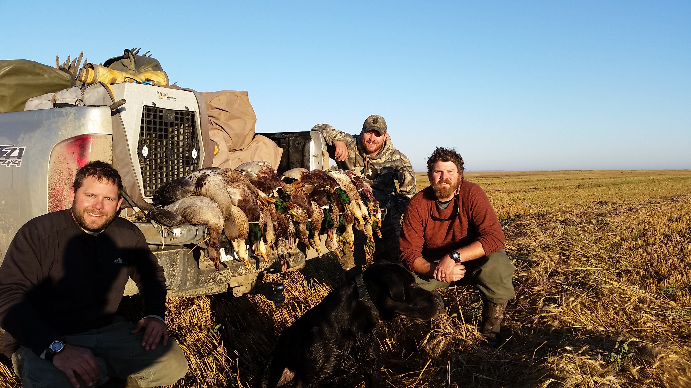
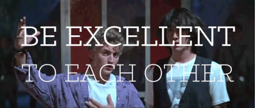

```{r setup, include=FALSE}
knitr::opts_chunk$set(echo = TRUE)
```


## Links to Lab Assignments

[Gahagan Week 1 Assignment](Lab1_BIG.html)

[Gahagan Week 2 Assignment](Lab2_BG.html)

[Gahagan Week 3 Assignment A](Lab3A_BG.html)

[Gahagan Week 3 Assignment B](Lab3B_BG.html)

[Gahagan Week 4 Assignment](Lab-4_BG.html)

[Gahagan Data Carpenters Visualization Exercises](Data_Vis_Exercises.html)

[Gahagan Week 5 Assignment](Lab5_BG.html)

[Gahagan Week 5 Extra Assignment](Lab5x_BG.html)

[Gahagan Week 6 Assignment](Lab6_BG.html)

[Gahagan Week 7 Assignment](Lab7_BG.html)

[Gahagan Week 8 Assignment](Lab8_BG.html)

[Gahagan Week 9 Assignment](Lab9A_BG.html)

[Gahagan Week 9 Extra Assignment](Lab9x_BG.html)

[Gahagan Week 10 Assignment](Lab10_BG.html)

[Gahagan Week 11 Assignment](Lab11_BG.html)

[Gahagan Week 11 Extra Assignment]()

[Gahagan Week 12 Assignment]()

[Gahagan Week 13 Assignment](https://gahaganbg.github.io/MyWebSite/)

## Some Background About Me
<font size="4">
I am a fisher,
{width=50%}

hunter,
{width=50%}

father,
{width=50%}


and [biologist](https://www.researchgate.net/profile/Ben_Gahagan).

I work for the [Massachusetts Division of Marine Fisheries](https://www.mass.gov/orgs/division-of-marine-fisheries) as a Diadromous Fish Biologist.

I am also a PhD student at UMASS Amherst in the [Environmental Conservation Department](https://eco.umass.edu/).

Here is a recent [CV](Gahagan CV 6_2020.pdf)

...and I am child of the 80's and 90's, so I will remind the world to



which does have a philosophical basis [@billnted]

Finally, if you are not having fun, why are you doing it?
</font>

## REFERENCES
